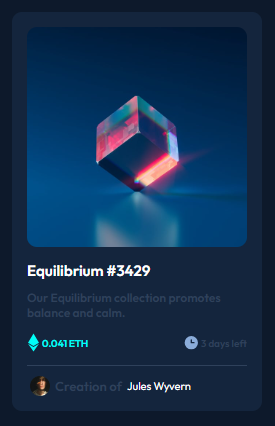
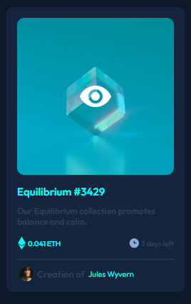

# Frontend Mentor

**NFT preview card component**

This HTML & CSS only challenge is perfect for anyone just starting out or anyone wanting a small project to play around with.

This is a solution to the [NFT preview card component](https://www.frontendmentor.io/challenges/nft-preview-card-component-SbdUL_w0U). Frontend Mentor challenges help you improve your coding skills by building realistic projects.

## Table of contents

- [Overview](#overview)
  - [The challenge](#the-challenge)
  - [Screenshot](#screenshot)
  - [Links](#links)
- [My process](#my-process)
  - [Built with](#built-with)
  - [What I learned](#what-i-learned)
  - [Continued development](#continued-development)
- [Author](#author)

## Overview

### The challenge

users should be able to:

View the optimal layout depending on their device's screen size
See hover states for interactive elements

### Screenshot




### Links

- Solution URL: [here](https://github.com/olahasan/HTML_AND_CSS_Frontend-Mentor-very-easy-NFT-preview-card-component)

- Live Site URL: [here](https://olahasan.github.io/HTML_AND_CSS_Frontend-Mentor-very-easy-NFT-preview-card-component/)

## My process

### Built with

- Semantic HTML5 markup
- CSS custom properties
- Flexbox
- CSS Grid
- Mobile-first workflow

### What I Learned

In this project, I learned how to effectively use CSS variables (`:root`) for maintaining a consistent color scheme and how to structure a responsive layout using Flexbox and CSS Grid. Here are some code snippets that I am proud of:

```css
:root {
  --Soft-blue: hsl(215, 51%, 70%);
  --Cyan: hsl(178, 100%, 50%);
  --Very-dark-blue-main-BG: hsl(217, 54%, 11%);
  --Very-dark-blue-card-BG: hsl(216, 50%, 16%);
  --Very-dark-blue-line: hsl(215, 32%, 27%);
  --White: hsl(0, 0%, 100%);
}
```

### Continued Development

I plan to continue improving my skills in responsive design and exploring more advanced CSS techniques. I also aim to enhance the accessibility of my projects.

### Author

Frontend Mentor - @olahasan<br>
GitHub - @olahasan
